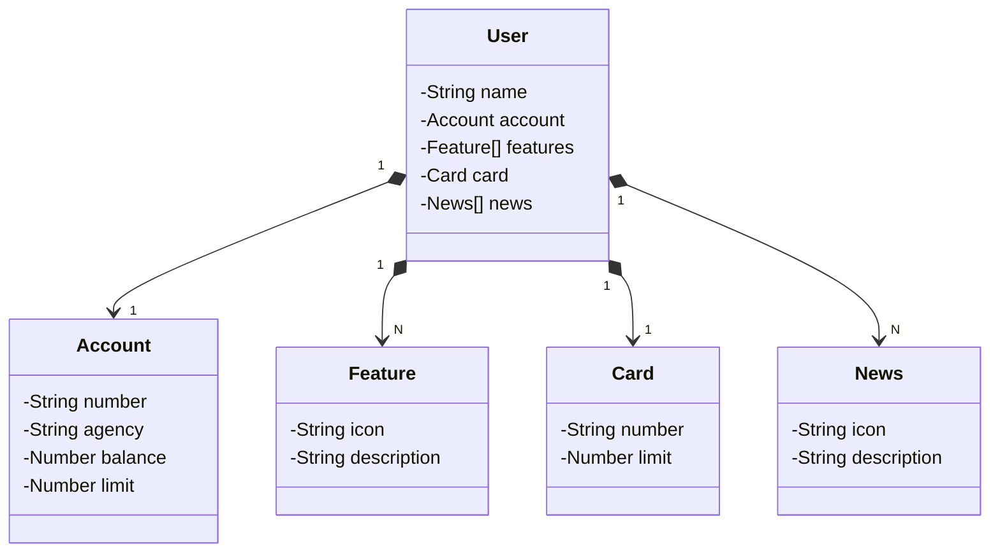

# Publicando sua API REST na Nuvem Usando Spring Boot 3, Java 17 e Railway

## Abstração Inicial do Domínio no Figma

<a href="https://www.figma.com/"><strong>Figma</strong></a> para criar as telas, com isso faz com que pensamos melhor na hora de codificar.

<a href="https://jsoneditoronline.org/"><strong>Json Editor Online</strong></a> transformando os dados na tela em Json para organizar melhor os elementos

```
{
  "name": "NomeDoUsuario",
  "accountNumber": "00000000-0",
  "accountAgency": "0000",
  "accountBalance": 1324.64,
  "accountLimit": 1000.00,

  "pixIcon": "",
  "pixDescription": "PIX",
  "payIcon": "",
  "payDescription": "Pagar",
  "transferIcon": "",
  "transferDescription": "Transferir",
  
  "cardNumber": "xxxx xxxx xxxx 0000",
  "cardLimit": 1000.00,

  "newsIcon": "",
  "newsDescription": "O Santander tem soluções de crédito sob medida pra você."
}
```

Alguamas informações são do usuario e outras informações são da conta deste usuario, seria melhor seprar estes dados para uma boa organização


```
{
  "name": "NomeDoUsuario",

  "acconunt":{  
    "Number": "00000000-0",
    "Agency": "0000",
    "Balance": 1324.64,
    "Limit": 1000.00
  },

  "features": [ 
    {
    "icon": "",
    "description": "PIX"
    }
  ],

  "card":{
    "Number": "xxxx xxxx xxxx 0000",
    "Limit": 1000.00
  },

  "news":[
    {
        "Icon": "URL",
        "Description": "Descrição da Novidade"
    }
  ]

}
```

note que diferente do primeiro exemplo que os elementos estavam todos dentro de um unico elemento raiz, no segundo exemplo as informações foram refinadas e trouxe para perto a orientação a objeto.


## Diagrama de Classes com ChatGPT e Mermaid

Utilize AI (Inteligencia Artificial) para auxiliar na criação de diagramas de classe exemplo: <a href="https://chatgpt.com/"><strong>ChatGPT</strong></a>.

### Diagrama de Classes



## Mapeamento Objeto Relacional (ORM)

### O que foi feito
> ## src/main/resources
> - Deletado: pastas e pacotes - templetes, static e application.properties (todas), pois não foi configurado nada e também não usaremos configuraçõs desta forma.
> - Criado: documento.yml pois é mais flexivel (application-dev.yml)

### Código de "application-dev.yml"

```

#Configurações Spring
spring:

   #Configurações Banco de dados
   database:
      #Criado o banco h2 com o nome sdw2023
      url: jdbc:h2:mem:sdw2023
      #Usuario: sdw2023
      username: sdw2023
      #Senha: sem senha
      password:
   
   #Configurações JPA
   jpa:
      #Essas configurações deixa as queryes mais verbosa e são mostradas no LOG
      show-sql: true
      open-in-view: false
      #hibernate crie as tabelas do banco no primeiro momento
      hibernate:
         ddl-auto: create # validate / update / create / create - drop
      properties:
         hibernate:
            format_sql: true
            
   #Configurações H2
   h2:
      console:
         enabled: true
         #/h2-console para acessar o banco no navegador
         path: /h2-console
         settings:
            trace: false
            web-allow-others: false
            
```


## Expondo Endpoints REST e Testando a API

### <a href="https://github.com/springdoc/springdoc-openapi">Swagger</a> 
Implementado manualmente no build.gradle do projeto.
```
//OpenAPI (Swagger) https://github.com/springdoc/springdoc-openapi
implementation 'org.springdoc:springdoc-openapi-starter-webmvc-ui:2.1.0'
```

## Provisionando o PostgreSQL Railway e Criando Perfil de PRD

Acesse o site do <a href="https://railway.app/project/bd58153c-5d45-426b-a4c8-362523f7cf6c/service/9b0f8bc7-01c9-4f8a-9bfa-8f0a23af4325/data"><strong>Railway</strong></a> para configrar o banco de dados

Adicione mais um arquivo .yml dentro do projeto (application-prd.yml)

### Código de "Application-prd.yml"
```
spring:
  datasource:
    url: jdbc:postgresql://${PGHOST}:${PGPORT}/${PGDATABASE}
    ursername: ${PGUSER}
    password: ${PGPASSWORD}
  jpa:
    open-in-view: false
    hibernate:
      ddl-auto: validate
```

## Configuração de inicialização IDE

Na IDE crie uma configuração de inicialização com o nome de "Application Prod" e as seguintes variaveis 

> Nome -> SPRING_PROFILE_ACTIVE
>> Valor -> prd

> Nome -> PGDATA

> Nome -> PGDATABASE

> Nome -> PGHOST

> Nome -> PGPASSWORD

> Nome -> PGPORT

>
 Nome -> PGUSER

os valores dessas variaveis é adiquirido no site do <a href="https://railway.app/project/bd58153c-5d45-426b-a4c8-362523f7cf6c/service/9b0f8bc7-01c9-4f8a-9bfa-8f0a23af4325/variables"><strong>Railway</strong></a> em Dashboard 


### ATENÇÃO: Railway não suporta o gradle na versão 8